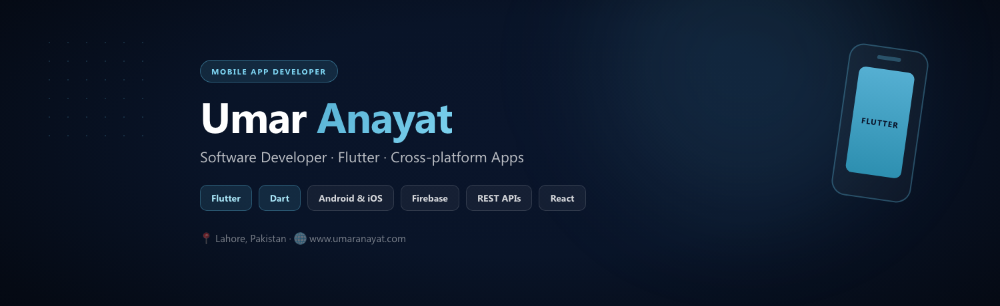

<!-- =========================================================
  Umar Anayat — GitHub Profile README
  Username: UmarAnayat
  Brand: #55AFD2 | Deep Navy
========================================================= -->

<div align="center">

<!-- ===== HEADER BANNER ===== -->


<br/><br/>

<a href="https://www.umaranayat.com">
  
</a>

<br/>

<a href="https://www.umaranayat.com">
  
</a>
&nbsp;
<a href="https://linkedin.com/in/umaranayat">
  
</a>
&nbsp;
<a href="mailto:iumaranayat@gmail.com">
  
</a>

</div>

---

## 👋 About Me

```dart
class UmarAnayat {
  final role = "Software Developer · Mobile App Developer (Flutter)";
  final location = "Lahore, Pakistan 🇵🇰";
  final focus = ["Flutter", "Dart", "Clean Architecture", "UI/UX"];
  final currently = "Building cross-platform mobile apps @ Genetum";
  final motto = "Ship fast. Keep it clean. Make it feel premium.";
}
```

I'm a **Flutter Developer** who builds fast, polished, cross-platform mobile apps for **Android & iOS**.  
I care about clean architecture, smooth UI, and code that stays readable months later.

- 💼 Currently working at **Genetum** (On-site) & **Berisco** (Remote)
- 📱 Building apps with **Flutter · Dart · Firebase · REST APIs**
- 🌐 Also working with **React / Next.js** when needed
- 📍 Based in **Lahore, Pakistan**
- 🔗 Portfolio → [www.umaranayat.com](https://www.umaranayat.com)

---

## 🛠️ Tech Stack

### Mobile


### Frontend & Backend


### Tools


---

## 📊 GitHub Stats

<div align="center">
  
  
  
</div>

<br/>

<div align="center">
  
</div>

<br/>

<div align="center">
  
</div>

<br/>

<div align="center">
  
</div>

---

## 🚀 Featured Work

| Project | What it is | Stack |
|--------|------------|-------|
| **Invoice Easy PK** | Invoice & billing mobile app | Flutter · Firebase |
| **QRMe** | QR-based mobile product | Flutter · APIs |
| **PetHuld** | Pet care / management app | Flutter · UI/UX |
| **Back Aware** | Health / awareness mobile app | Flutter · Dart |
| **GoDrive** | Ride / mobility experience | Flutter · REST |
| **Quran E Pak** | Islamic app experience | Flutter · Clean UI |
| **Visual Kids** | Kids learning experience | Flutter · Fun UI |
| **Tarot** | Lifestyle / content app | Flutter · Design |
| **Power Fitness Hub** | Fitness tracking app | Flutter · Firebase |

> Portfolio pe zyada detail → **[www.umaranayat.com](https://www.umaranayat.com)**

---

## 📈 Activity

<!-- Snake: workflow run ke baad yeh line uncomment kar dena -->
<!--  -->

<div align="center">
  
</div>

---

## 🤝 Let's Connect

<div align="center">

| | |
|:--|:--|
| 🌐 **Website** | [www.umaranayat.com](https://www.umaranayat.com) |
| 💼 **LinkedIn** | [linkedin.com/in/umaranayat](https://linkedin.com/in/umaranayat) |
| 📧 **Email** | [iumaranayat@gmail.com](mailto:iumaranayat@gmail.com) |
| 📍 **Location** | Lahore, Pakistan |

<br/>


<br/><br/>

**Open for Flutter / Mobile App Developer roles & collaborations.**

⭐ From [Umar Anayat](https://github.com/UmarAnayat) — *Clean code. Smooth apps. Modern craft.*

</div>
