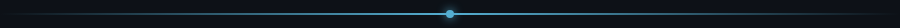
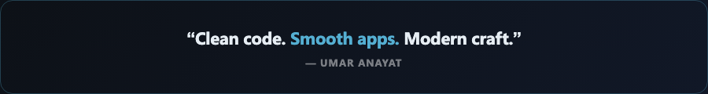

<!-- =========================================================
  Umar Anayat — Instagram-style Heavy Professional Profile
  Brand: #55AFD2 | Deep Navy
========================================================= -->

<div align="center">
  
</div>

<br/>

<div align="center">
  <a href="https://www.umaranayat.com">
    
  </a>
</div>

<div align="center">
  <a href="https://www.umaranayat.com"></a>
  <a href="https://linkedin.com/in/umaranayat"></a>
  <a href="mailto:iumaranayat@gmail.com"></a>
  <a href="https://github.com/UmarAnayat"></a>
</div>

<br/>
<div align="center">
  
</div>

---

##  About Me

<div align="center">

```dart
developer = {
  "name"       : "Umar Anayat",
  "role"       : "Software Developer | Flutter Mobile Engineer",
  "location"   : "Lahore, Pakistan 🇵🇰",
  "stack"      : ["Flutter", "Dart", "Firebase", "UI/UX", "REST APIs"],
  "companies"  : ["Genetum", "Berisco"],
  "focus"      : "Cross-platform apps that feel native & premium",
  "status"     : "Open for Flutter / Mobile roles 🚀"
};
```

</div>

I'm a **Flutter Developer** who ships polished Android & iOS apps with clean architecture, smooth motion, and production-ready UI.

- 💼 Building products at **Genetum** (On-site) + **Berisco** (Remote)
- 📱 Specializing in **Flutter · Dart · Firebase · REST APIs**
- 🎨 Obsessed with **clean UX** and performance-first UI
- 🌐 Also comfortable with **React / Next.js** when needed
- 🔗 Portfolio → **[www.umaranayat.com](https://www.umaranayat.com)**

<br/>
<div align="center">
  
</div>

---

##  Tech Arsenal

<div align="center">
  <br/>
  
  <br/><br/>

  
  
  
  
  
</div>

<br/>
<div align="center">
  
</div>

---

##  GitHub Analytics

<div align="center">
  
</div>

<br/>

<div align="center">
  
  
  
</div>

<br/>

<div align="center">
  
</div>

<br/>

<div align="center">
  
</div>

<br/>

<div align="center">
  <h3>📅 Contribution Graph</h3>
  
</div>

<!-- Snake animation (enable after Actions workflow runs once)
<div align="center">
  
</div>
-->

<br/>
<div align="center">
  
</div>

---

##  Featured Projects

<div align="center">

| 🔥 Project | 📌 What I Built | 🧰 Stack |
|:-----------|:----------------|:---------|
| **Invoice Easy PK** | Invoice & billing mobile experience | Flutter · Firebase |
| **QRMe** | QR-based product app | Flutter · REST APIs |
| **PetHuld** | Pet care management app | Flutter · UI/UX |
| **Back Aware** | Health / awareness mobile app | Flutter · Dart |
| **GoDrive** | Ride / mobility experience | Flutter · APIs |
| **Quran E Pak** | Islamic app with clean UI | Flutter · Firebase |
| **Visual Kids** | Kids learning experience | Flutter · Design |
| **Tarot** | Lifestyle content app | Flutter · Smooth UI |
| **Power Fitness Hub** | Fitness tracking platform | Flutter · Firebase |

</div>

<br/>

<div align="center">
  <a href="https://www.umaranayat.com">
    
  </a>
</div>

<br/>
<div align="center">
  
</div>

---

##  What I Bring

<div align="center">

| | | |
|:--:|:--:|:--:|
| ⚡ **Fast Delivery** | 🎯 **Pixel-clean UI** | 🧩 **Clean Architecture** |
| Flutter apps that ship | UX that feels premium | Code that scales |
| 🔥 **Firebase Ready** | 📱 **Android + iOS** | 🧠 **Problem Solver** |
| Auth, DB, Storage, FCM | One codebase, two stores | Features → production |

</div>

<br/>
<div align="center">
  
</div>

---

##  Let's Build Something

<div align="center">

### Open for **Flutter Developer** roles & freelance collaborations

<br/>

| Contact | Link |
|:--------|:-----|
| 🌐 **Website** | [www.umaranayat.com](https://www.umaranayat.com) |
| 💼 **LinkedIn** | [linkedin.com/in/umaranayat](https://linkedin.com/in/umaranayat) |
| 📧 **Email** | [iumaranayat@gmail.com](mailto:iumaranayat@gmail.com) |
| 📍 **Location** | Lahore, Pakistan |

<br/>


<br/><br/>



<br/>

**⭐ From [Umar Anayat](https://github.com/UmarAnayat)** — if you like the vibe, drop a star on my repos.

</div>
